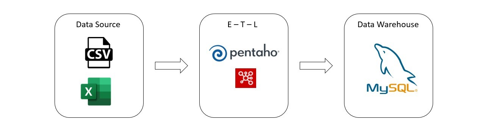
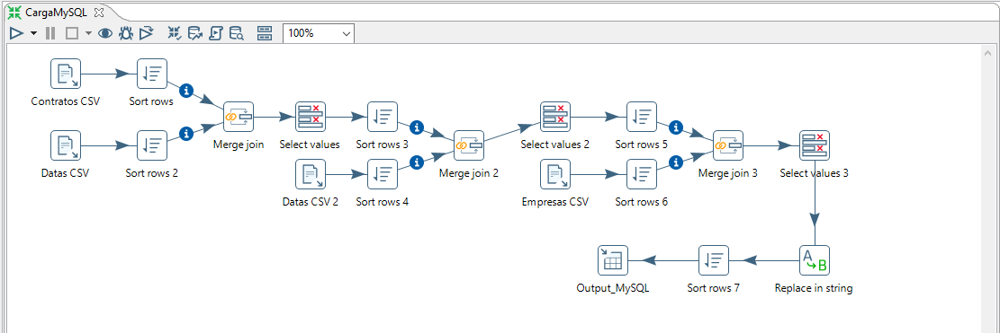

## ETL Com Pentaho Data Integration

Projeto: Desenvolvimento de um Pipeline de ETL (Extract, Transform and Load) utilizando Pentaho Data Integration.

O Pentaho Data Integration é uma ferramenta totalmente open source (de código aberto), que oferece recursos robustos de ETL para extrair, transformar e carregar dados de diversas fontes em um formato estruturado, possibilitando análise de dados, desenvolvimento de relatórios e tomada de decisão com maior assertividade.

## Etapas de Desenvolvimento

1. Extração de dados
    - CSV file input (Importação de arquivos e preview dos dados)

2. Limpeza, transformação e enriquecimento de dados
    - Sort rows (Order by)
    - Merge join (Join entre tabelas)
    - Select values (Remoção e Renomeação de colunas)
    - Replace in string (Correção de registros incorretos)
   
3. Carregamento desses dados no banco de dados MySQL
    - Table output (Conectando no MySQL e Carregando os dados)

## Protótipo do Pipeline

## Desenvolvimento do Pipeline

## Passo a Passo

Utilizando o Pentaho Data Integration (Spoon), extraí três tabelas com dados no formato .csv utiliando o step CSV file input, com esse mesmo step é possível iniciar as transformações, modificando o tipo de dados, retirando os espaços no inicio e no fim de cada palavra e fazer o Preview dos dados.
Em seguida, utilizei o step Sort rows para ordernar as colunas de id e o step Merge join para fazer o join entre tabelas, em seguida utilizei o step Select values para remover e renomear colunas, também utilizei o step Replace in string para corrigir alguns registros incorretos na base dados.
Por fim, utilizei o step Table output para conectar no banco de dados MySQL e carregar os dados.

## Geração de Valor para o Negócio

#### Qualidade dos Dados:
O processo de limpeza, transformação e enriquecimento dos dados garante que as informações sejam consistentes, corretas e confiáveis.

#### Tomada de Decisão Baseada em Dados:
Um projeto de ETL bem-sucedido fornece dados preparados e prontos para análise, isso permite que a empresa tome decisões mais assertivas.

#### Eficiência Operacional e Redução de Erros:
Automatizar o processo de ETL reduz a necessidade de trabalho manual e repetitivo, economizando tempo e esforço da equipe, permitindo a criação de relatórios, painéis e análises de forma mais rápida e eficiente, demonstrando uma resposta ágil às mudanças do mercado, bem como reduz a probabilidade de erros humanos que podem ocorrer durante atividades manuais de extração, transformação e carregamento de dados.

#### Escalabilidade:
Utilizando uma estrutura robusta, o projeto pode lidar com grandes volumes de dados e crescer conforme as necessidades do negócio.

## Sobre o Desenvolvedor

Lucas Ramalho atua como Senior Data Analyst e Analytics Engineer, é formado em Big Data e Inteligência Competitiva, atua com dados desde 2021 e já atuou em diferentes segmentos como Varejo, Logística, Indústria e Tecnologia.

Atua no desenvolvimento de soluções em dados para apoiar a tomada de decisão e melhorar o desempenho dos negócios ao utilizar os dados de forma eficiente e estratégica.

Possui forte experiência em Manipulação de dados, Pipelines de ETL/ELT, Modelagem de dados, Qualidade de dados, Documentação Técnica e Visualização de dados.

Conheça mais detalhes no [LinkedIn](https://www.linkedin.com/in/olucasramalho/).

Fique a vontade para se conectar nas redes sociais:

 
  
  
  

